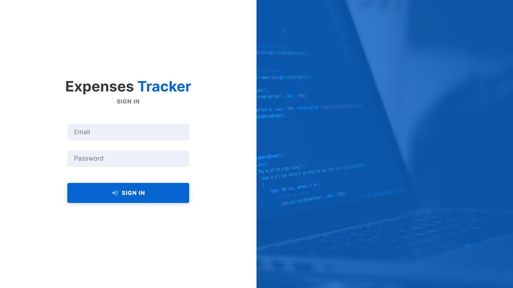
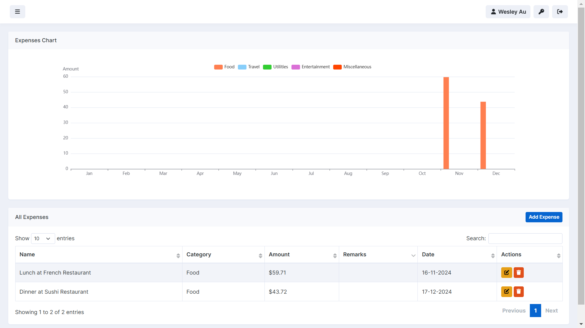
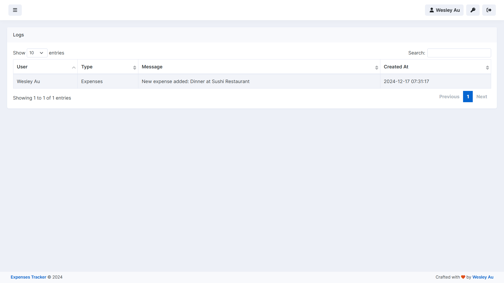

# Laravel Expense Tracker

A Laravel-based web application for tracking and managing expenses. This app provides features for creating, viewing, editing, and deleting expenses, with categorized monthly summaries to analyze spending patterns.

## Features

-   **Data Visualization**: Analyze expenses grouped by month and category for the current year.
-   **Expenses Summary**: View an index of all expenses.
-   **Custom Log Service**: Log critical actions such as creating, editing, or deleting expenses.
-   **Authentication**: Restrict access to expense management features to authenticated users only.

## Screenshots

