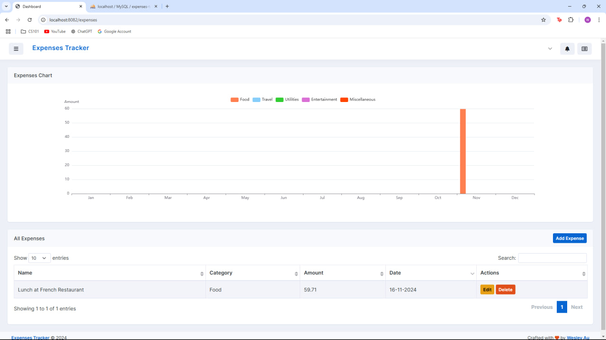

# Laravel Expense Tracker

A Laravel-based web application for tracking and managing expenses. This app provides features for creating, viewing, editing, and deleting expenses, with categorized monthly summaries to analyze spending patterns.

## Features

-   **eCharts Visualization**: Analyze expenses grouped by month and category for the current year.
-   **Datatable Summary**: View a summary of all expenses using DataTables.
    Open your browser and go to:
    ```
    http://127.0.0.1:8000
    ```

## Application Routes

### Web Routes

-   **`GET /`**: Displays a list of all expenses with categorized monthly summaries.
-   **`GET /expenses/create`**: Form to create a new expense.
-   **`POST /expenses`**: Save a new expense to the database.
-   **`GET /expenses/{expense}/edit`**: Form to edit an existing expense.
-   **`PUT /expenses/{expense}`**: Update the details of an expense.
-   **`DELETE /expenses/{expense}`**: Delete an expense.

## Logging

The app uses a custom logging service to track important actions like creating new expenses.

## Screenshots




